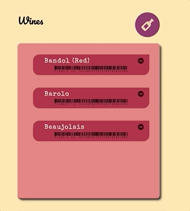
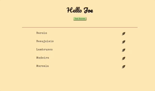

# Tannin

  

Tannin is a react app designed to help restaurant management educate and test their staff on wine knowledge for their current wine list. Wine is a detailed and nuanced subject that requires attention and practice to learn. Restaurants are a fast paced, hectic work environment that require a lot of quick thinking and physical labor. Tannin is designed to make studying wine as easy as possible for employees and just as easy for management to track.

  

* We are currently using and adding to our own API. Find more details at our [Tannin-API](https://github.com/leifaesoph/Tannin-API) repo.

  

  

## Usage:

The app has two distinct interfaces:

  

### 1. Admin/manager:

  

### A. Sign-up

On initial sign-up, your provided information will be used to create a restaurant and an admin employee for that restaurant.

  

  

### B. Wine

You will be logged into your restaurant's admin page where you can view the details of your current wine list, remove wines from that wine list or add new wines.

  

  

You will be redirected to a page with our master wine list. Here you can see the specifications of each wine in our database, see if it matches what you hold in stock, and then add the new wines to your restaurant.

  

  

### C. Employees

The admin can manually add new employees with their first name, last name, email address and a password set by the admin. The given email address will receive an automatic message once their account has been created giving them their password.

  

  

The admin can see the employees' full information complete with the scores of any tests they have completed. They may also delete employees who no longer work for them.

  

___
  
  
  

### 2. Employee:

  

### A. Sign-up

When an employee signs in with their given credentials, they are directed to a list of the current wines for their restaurant as well as access to a quiz for each wine.

  

  

### B. Quizes

Each wine can be tapped for information that will come up on its respective quiz. Each quiz dynamically generates and shuffle questions for each data point archived on that wine. Employees can get a score between 0 and 100, with their highest scores being saved to their page upon submission.

  

  

### C. Quiz Scores

An employee can also see the high scores of all of the quizes they have taken before.

  

  

  
  

## Future Development:

  

In the future, our team hopes to create a react native app. A phone compatible interface would be particularly useful for the employee interface since our goal is to make it as easy as possible for employees to take quizes and have scores for their management to see.

  

On the subject of quizes, we still need to work on filtering out duplicate answers to questions and locking buttons so that a question can only be answered once per quiz.

  

We will also implement a way for admins to grant admin status and for all employees to change their passwords.

  

  

## Components Used:

  

- Visual Studio Code

- React

- JavaScript

- CSS

- Ajax

- GitHub

- Heroku

- MongoDB

- Mongoose

- Node

- Express

- Passport

- Nodemailer

- [Tannin-API](https://github.com/leifaesoph/Tannin-API)

  
  

  

## Authors:

  

- Leif Asoph

- Ruili Gao

- Micah Rabinowitz

- Dennis Sarmiento

  

  
  

## Link:

https://tannin-api.herokuapp.com/api/wine

https://leifaesoph.github.io/Tannin/
